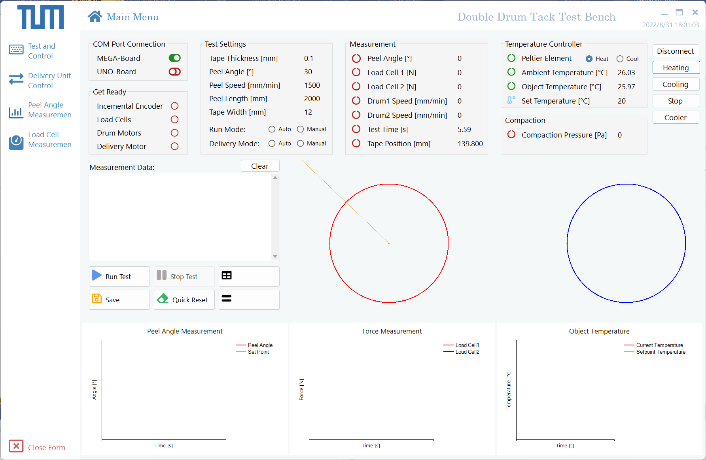

# Desktop application for the double drum tack test bench
This desktop application provides a user interface for controlling the test workbench.

## Functions
### Main Menu
- Overview of entire settings, data and device information
- Control the temperature system
- Simulation diagram of the peel angle in real-time
- Chart of peel angle-, force- and temperature measurement
- Start and stop the tack test, save the test data 

### Drum Control and Settings
- Connect or disconnect to Arduino MEGA
- Input, edit, export and determine parameter settings
- Control motors of the drum automatically
- Test and adjust motors of the drum manually

### Delivery Unit Control
- Connect or disconnect to Arduino MEGA
- Control delivery unit in automatic loop
- Test and adjust delivery unit manually

### Peel Angle Measurement
- Connect or disconnect to Arduino UNO
- Set the peel angle
- Test and measure the peel angle
- Chart of peel angle measurement
- Save measured data

### Force Measurement
- Connect or disconnect to Arduino UNO
- Test load cells and measure the force
- Chart of force measurement
- Save measured data
